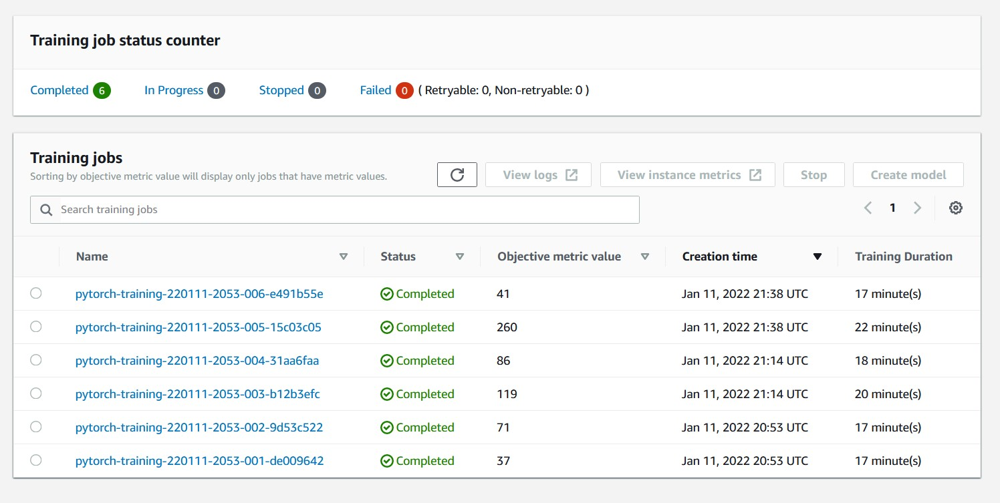
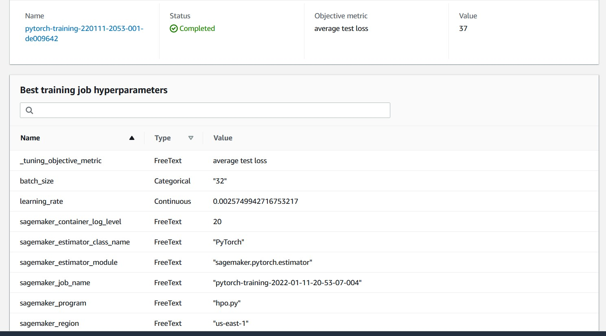
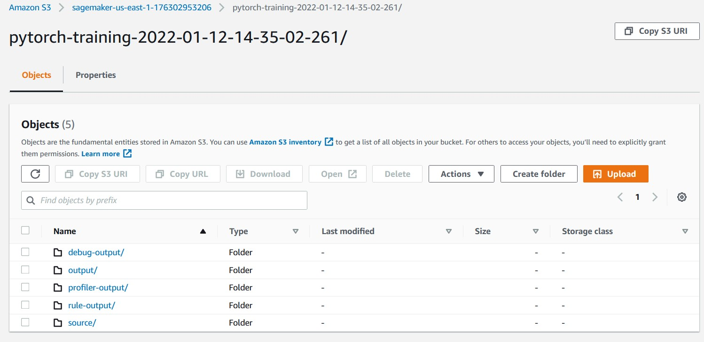
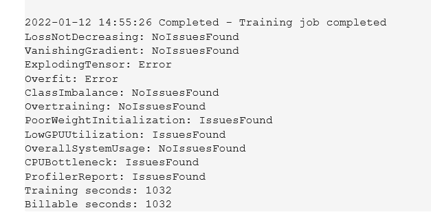
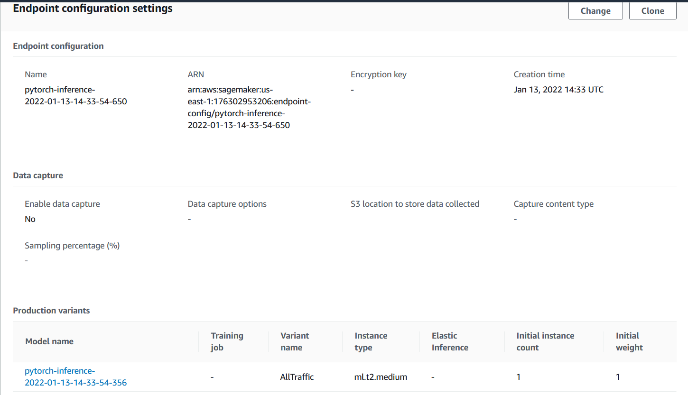

# Image Classification using AWS SageMaker

Use AWS Sagemaker to train a pretrained model that can perform image classification by using the Sagemaker profiling, debugger, hyperparameter tuning and other good ML engineering practices. This can be done on either the provided dog breed classication data set or one of your choice.

## Project Set Up and Installation
Enter AWS through the gateway in the course and open SageMaker Studio. 
Download the starter files.
Download/Make the dataset available. 

## Dataset
The provided dataset is the dogbreed classification dataset which can be found in the classroom.
The project is designed to be dataset independent so if there is a dataset that is more interesting or relevant to your work, you are welcome to use it to complete the project.

### Access
Upload the data to an S3 bucket through the AWS Gateway so that SageMaker has access to the data. 

## Hyperparameter Tuning

The model is adapted from a resnet50 pretrained model. It is based on convolutional layers adapted for ML vision. So I took profit of transfer learning and already pretuned parameters. Dense layers were added on top to perform classification (my needs)._

For hyperparameters, I tuned the two following ones : 
- The batch size for loading and training the data
It is a categorical parameter which values are chosen amongst three : 32, 64 or 128
- The learning_rate for the optimizer ("adam" in this tuning)
It is a continuous parameter whose values are between 0.001 and 0.01
These hyperparameter ranges were passed in an HyperparameterTuner instance.

#### 1) Screenshot of completed hyperparameter tuning jobs:

#### 2) Screenshot of best hyperparameters training job :

#### 3) Metrics of hyperparameter tuning jobs (What is logged internally in the program and that the hook exploits):

#### 4) Cloudwatch metrics during the training process (what AWS sees externally):

## Debugging and Profiling

### Method overview

- I created a hook in the train_model.py file :
    hook = smd.Hook.create_from_json_file()
    hook.register_hook(model)
- I passed it as argument in the train and test functions
- In the train function, I set the "TRAIN" mode during training -hook.set_mode(smd.modes.TRAIN)-, and "EVAL" during validation -hook.set_mode(smd.modes.EVAL)-
- In the test function, it was naturally set to EVAL mode.

The configs for profiler and debugger are prepared in the following dictionaries : profiler_config and debugger_config, and then passed to profiler_config and 
debugger_hook_config arguments of an estimator, as well as chosen rules.
Here are the ones I tested:
- Debugger rules:
loss_not_decreasing(), vanishing_gradient(), exploding_tensor(), overfit(), class_imbalance() (can be used with this pytorch DL framework), overtraining(), poor_weight_initialization()
- Profiler rules:    
LowGPUUtilization(), OverallSystemUsage(), CPUBottleneck()

#### Artifact folders created after debugging and profiling jobs

### Results

Here is the repartition of the different rules tested.

"GPU" has not been used, so LowGPUUtilization is not relevant. 
What would be interesting to investigate are the "explodingTensor" and "Overfit" errors. It seems that coefficients of tensors are getting bigger and bigger. 
Moreover, with overfitting, the model adapt to training data, but not so well for validation data...
And some issues are found for initialization of weights and maybe for CPU bottlenecks.

#### Report
In the "System usage statistics", it is said : "The 95th percentile of the total CPU utilization is only 60%". So most of the time, the CPU seems to be underutilized (even if it seems there are some CPU bottlenecks). So a smaller instance shoud be recommanded (I used a "ml.p3.2xlarge" one)

In the "Overview: CPU operators" subpart, it is interesting to see that different tasks of convolutional layers are equally reparted, so there isn't a bottleneck at a specific layer.

Recommandations are given but they may contradict other choices (batch size should be augmented, but it was a choice of hyperparameter tuning process).

In the "Dataloading analysis", it is said "Your training instance provided 8 CPU cores, however your training job only ran on average 1 dataloader workers in parallel". So if I would have to reload a job on this instance, I would augment the number of dataworkers in parallel to take maximum profit of the throughput.

For the "CPU bottlenecks", the rule is to compare CPU and GPU usages. As GPU was not used, it considers CPU is overused, and that a part of the job should have been dedicated to GPU.

## Model Deployment
Here is the python instruction I used:
pytorch_model = PyTorchModel(model_data=model_location, role=role, entry_point='inference.py',py_version='py3',
                             framework_version='1.4')

The model was recovered from the location where it was saved in S3 (with argument model_data in the PyTorch constructor class). 

Remark : I had to get an entry point with a python file I recovered from the Course 5 ("inference.py" in the "Operationalizing Machine Learning in Sagemaker"), as I could not use the "train_model.py" one(It is a separated instance for inference estimating and smdebug was not installed on this instance, so I got an error as "train_model.py" uses smdebug).

Then it was deployed and I got the endpoint_name (attribute), and created an instance of a Predictor class with this name.

I adapted the input format of the endpoint (predictor.serializer = IdentitySerializer("image/png")), to take into account images.
And then I launched a prediction with an image in "local" instance. Unfortunately, I got the following error : "An error occurred (InternalFailure) when calling the InvokeEndpoint operation (reached max retries: 4)". I will investigate furthermore if there is still time.

Here is a screenshot of a deployed active endpoint :

